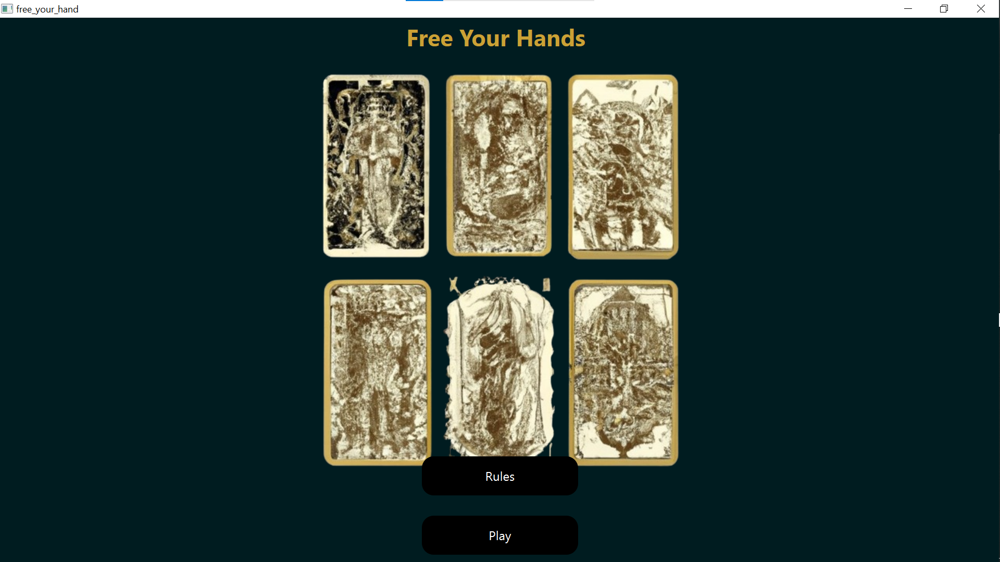
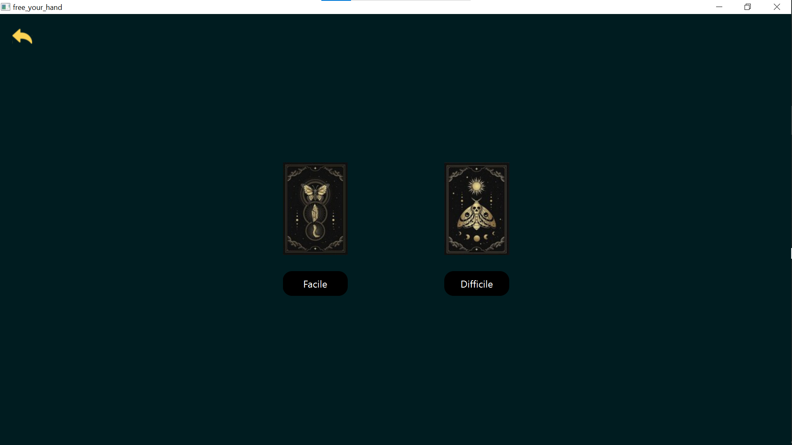
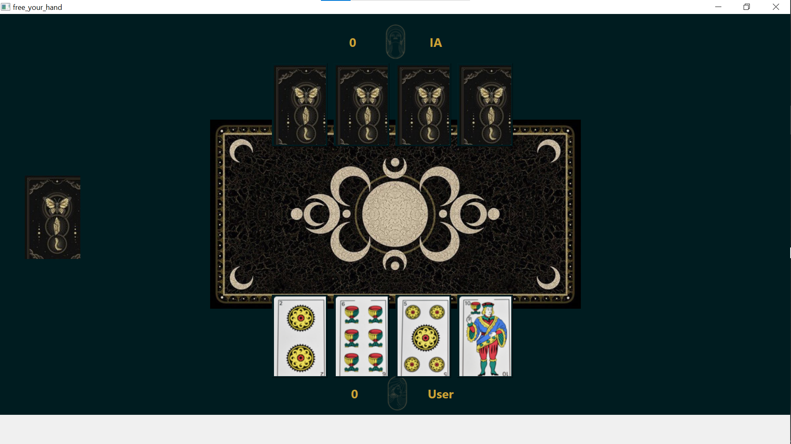
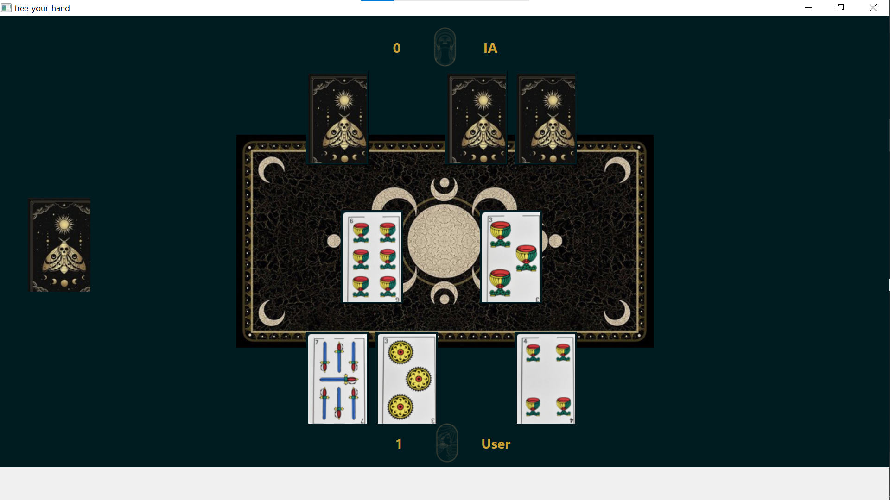
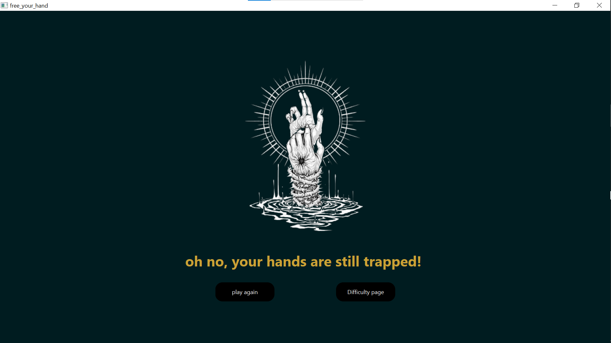
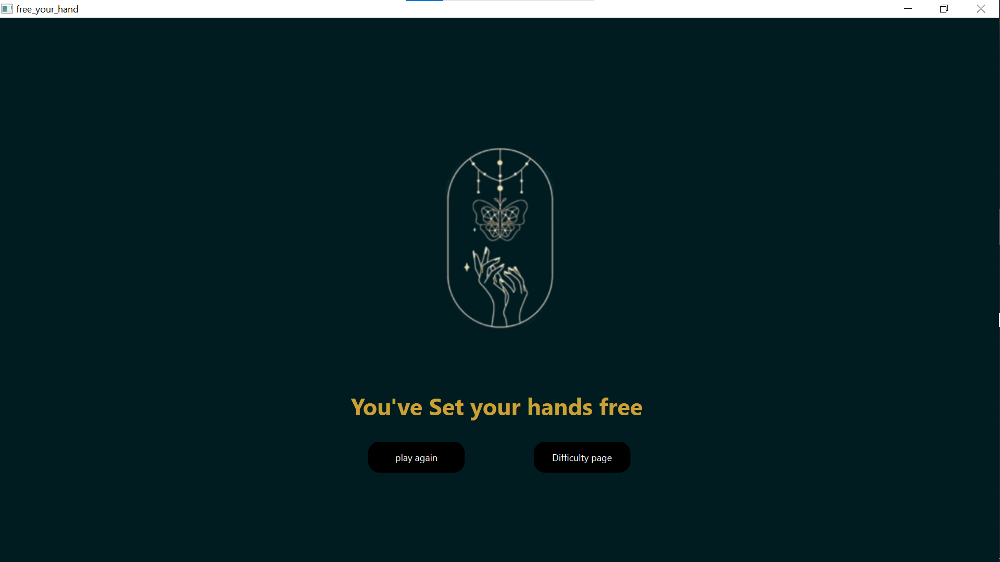

# Game Rules

## 1. Distribution des Cartes :
- Chaque joueur, l'utilisateur et l'IA (Intelligence Artificielle), commence avec 4 cartes.

## 2. Jouer une Carte :
- Le but est de jouer une carte sur la table.
- Le joueur avec le nombre le plus élevé sur sa carte remporte la manche.

## 3. Points et Victoire :
- Pour la difficulté facile :
  - L'IA et l'utilisateur commencent avec le même nombre de points.
  - Lorsqu'un joueur remporte une manche, il gagne un point.
- Pour la difficulté difficile :
  - Quand l'IA remporte une manche, elle gagne 2 points.
  - L'utilisateur gagne 1 point lorsqu'il remporte une manche.

## 4. Détermination du Gagnant :
- Le gagnant est le joueur qui a le plus de points à la fin du jeu.

# Screenshots

Below are the screenshots demonstrating the game:

